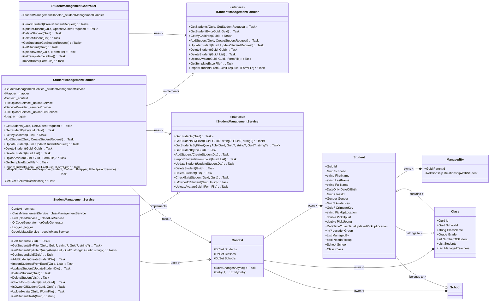

# Student Management Class Diagram

```mermaid
classDiagram
    direction LR
    %% Main layers from left to right: Controller -> Handler -> Service -> Domain
    
    %% Controllers (Left)
    class StudentManagementController {
        -IStudentManagementHandler _studentManagementHandler
        +CreateStudent(CreateStudentRequest): Task<ActionResult<StudentDetailResponse>>
        +UpdateStudent(Guid, UpdateStudentRequest): Task<ActionResult<StudentDetailResponse>>
        +DeleteStudent(Guid): Task<IActionResult>
        +DeleteStudent(List<Guid>): Task<IActionResult>
        +GetStudents(GetStudentRequest): Task<Pagination<StudentResponse>>
        +GetStudent(Guid): Task<StudentDetailResponse>
        +UploadAvatar(Guid, IFormFile): Task<IActionResult>
        +GetTemplateExcelFile(): Task<IActionResult>
        +ImportData(IFormFile): Task<ActionResult>
    }

    %% Handlers (Middle-Left)  
    class StudentManagementHandler {
        -IStudentManagementService _studentManagementService
        -IMapper _mapper
        -Context _context 
        -IFileUploadService _uploadService
        -IServiceProvider _serviceProvider
        -IFileUploadService _uploadFileService
        -ILogger<StudentManagementHandler> _logger
        +GetStudents(Guid, GetStudentRequest): Task<Pagination<StudentResponse>>
        +GetStudentById(Guid, Guid): Task<StudentDetailResponse>
        +GetMyChildren(Guid): Task<IEnumerable<StudentResponse>>
        +AddStudent(Guid, CreateStudentRequest): Task<StudentDetailResponse>
        +UpdateStudent(Guid, UpdateStudentRequest): Task<StudentDetailResponse>
        +DeleteStudent(Guid, Guid): Task
        +DeleteStudent(Guid, List<Guid>): Task
        +UploadAvatar(Guid, Guid, IFormFile): Task<string>
        +GetTemplateExcelFile(): Task<MemoryStream>
        +ImportStudentsFromExcelFile(Guid, IFormFile): Task
        -MapStudent2StudentResponse(Student, Context, IMapper, IFileUploadService): Task<StudentDetailResponse>
        -GetExcelColumnDefinitions(): List<ExcelColumnDefinition<Student>>
    }

    %% Interfaces (Middle)
    class IStudentManagementHandler {
        <<interface>>
        +GetStudents(Guid, GetStudentRequest): Task<Pagination<StudentResponse>>
        +GetStudentById(Guid, Guid): Task<StudentDetailResponse>
        +GetMyChildren(Guid): Task<IEnumerable<StudentResponse>>
        +AddStudent(Guid, CreateStudentRequest): Task<StudentDetailResponse>
        +UpdateStudent(Guid, UpdateStudentRequest): Task<StudentDetailResponse>
        +DeleteStudent(Guid, Guid): Task
        +DeleteStudent(Guid, List<Guid>): Task
        +UploadAvatar(Guid, Guid, IFormFile): Task<string>
        +GetTemplateExcelFile(): Task<MemoryStream>
        +ImportStudentsFromExcelFile(Guid, IFormFile): Task
    }

    class IStudentManagementService {
        <<interface>>
        +GetStudents(Guid): Task<IEnumerable<Student>>
        +GetStudentsByFilter(Guid, Guid?, string?, Guid?, string?): Task<IEnumerable<Student>>
        +GetStudentsByFilterQueryAble(Guid, Guid?, string?, Guid?, string?): Task<IQueryable<Student>>
        +GetStudentById(Guid): Task<Student>
        +AddStudent(CreateStudentDto): Task<Student>
        +ImportStudentsFromExcel(Guid, List<Student>): Task
        +UpdateStudent(UpdateStudentDto): Task<Student>
        +DeleteStudent(Guid): Task
        +DeleteStudent(List<Guid>): Task
        +CheckExistStudent(Guid, Guid): Task
        +IsOwnerOfStudent(Guid, Guid): Task
        +UploadAvatar(Guid, IFormFile): Task<string>
    }

    %% Services (Middle-Right)
    class StudentManagementService {
        -Context _context
        -IClassManagementService _classManagementService
        -IFileUploadService _uploadFileService
        -IQrCodeGenerator _qrCodeGenerator
        -ILogger<StudentManagementService> _logger
        -GoogleMapsService _googleMapsService
        +GetStudents(Guid): Task<IEnumerable<Student>>
        +GetStudentsByFilter(Guid, Guid?, string?, Guid?, string?): Task<IEnumerable<Student>>
        +GetStudentsByFilterQueryAble(Guid, Guid?, string?, Guid?, string?): Task<IQueryable<Student>>
        +GetStudentById(Guid): Task<Student>
        +AddStudent(CreateStudentDto): Task<Student>
        +ImportStudentsFromExcel(Guid, List<Student>): Task
        +UpdateStudent(UpdateStudentDto): Task<Student>
        +DeleteStudent(Guid): Task
        +DeleteStudent(List<Guid>): Task
        +CheckExistStudent(Guid, Guid): Task
        +IsOwnerOfStudent(Guid, Guid): Task
        +UploadAvatar(Guid, IFormFile): Task<string>
        +GetStudentHash(Guid): string
    }

    %% Domain Entities (Right)
    class Context {
        +DbSet<Student> Students
        +DbSet<Class> Classes
        +DbSet<School> Schools
        +SaveChangesAsync(): Task
        +Entry<T>(T): EntityEntry<T>
    }

    class Student {
        +Guid Id
        +Guid SchoolId
        +string FirstName
        +string LastName 
        +string FullName
        +DateOnly DateOfBirth
        +Guid ClassId
        +Gender Gender
        +Guid? AvatarKey
        +Guid? QrImageKey
        +string PickUpLocation
        +double PickUpLat
        +double PickUpLng
        +DateTime? LastTimeUpdatedPickupLocation
        +int? LocationGroup
        +List<ManagedBy> ManagedBy
        +bool NeedsPickup
        +School School
        +Class Class
    }

    class Class {
        +Guid Id
        +Guid SchoolId
        +string ClassName
        +Grade Grade
        +int NumberOfStudent
        +List<Student> Students
        +List<ManagedTeacher> ManagedTeachers
    }

    class ManagedBy {
        +Guid ParentId
        +Relationship RelationshipWithStudent
    }

    %% Relationships ordered by layers
    %% Inheritance (--|>) Left to Right
    StudentManagementHandler --|> IStudentManagementHandler : implements
    StudentManagementService --|> IStudentManagementService : implements

    %% Composition (--*) Right to Left 
    Context --* Student : owns <
    Context --* Class : owns <
    Context --* School : owns <
    Student --* ManagedBy : owns <

    %% Aggregation (--o) Bidirectional
    Class --o Student : contains >
    Student --o Class : belongs to >  
    Student --o School : belongs to >
    
    %% Association (-->) Left to Right
    StudentManagementController --> IStudentManagementHandler : uses >
    StudentManagementHandler --> IStudentManagementService : uses >
    StudentManagementService --> Context : uses >
    StudentManagementHandler --> Context : uses >
```
